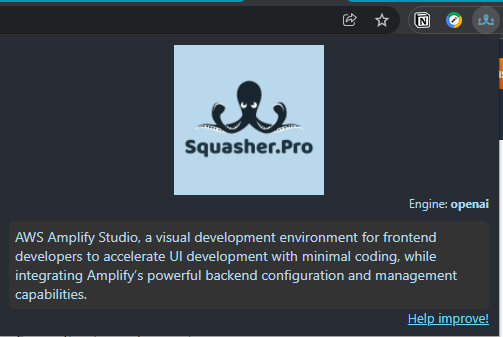

# Squasher.Pro Chrome extension


## How to use?

Click on the extension icon to activate the extension. The extension will squash the current page for you. Please help with the feedback to improve the suggestions.



## Developer setup

```bash
npm install
npm start
```

### Load the extension in Chrome:

- Go to chrome://extensions/
- Turn on `Developer mode`
- Click on the "Load unpacked extension" button
- Select the `build` folder of this extension
- Changes will reflect immediately in the browser (no need to reload the page). If you are making changes to content scripts, page reload will be required.

### Tech details

This extension uses:

- [Chrome Extension Manifest V3](https://developer.chrome.com/docs/extensions/mv3/intro/mv3-overview/)
- [React 17](https://reactjs.org)
- [Webpack 5](https://webpack.js.org/)
- [Webpack Dev Server 4](https://webpack.js.org/configuration/dev-server/)
- [React Hot Loader](https://github.com/gaearon/react-hot-loader)
- [eslint-config-react-app](https://www.npmjs.com/package/eslint-config-react-app)
- [Prettier](https://prettier.io/)
- [TypeScript](https://www.typescriptlang.org/)

Bootstrapped using [this boilerplate](https://github.com/lxieyang/chrome-extension-boilerplate-react)
