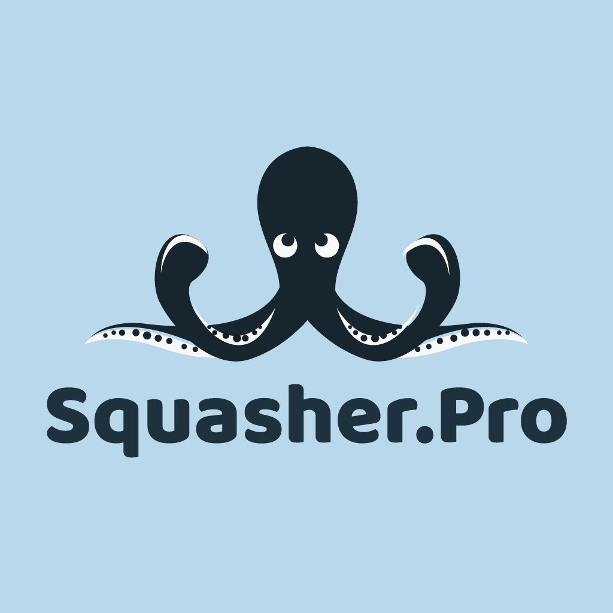

# Squasher.Pro Outlook add-in



## How to use?

Office add-ins have plenty of [options](https://docs.microsoft.com/en-us/office/dev/add-ins/publish/publish) for deployment and publishing the add-in. But, none of that seems straightforward for internal distribution. For now, if you are interested in using this add-in, you will have to follow the developer steps below.

## Developer setup

```bash
npm install
npm run build:dev
npm start
```

### Sideload the add-in:

- Follow instructions [here](https://docs.microsoft.com/en-us/office/dev/add-ins/outlook/sideload-outlook-add-ins-for-testing) to sideload the add-in to Outlook

### Known issues

- If you are on Office 2016, the extension will not render correctly. Office 2016 uses IE11 as the rendering engine and is painful to support that.
- Developers need to have local loopback server running on port 3000. If you receive the error "We can't open this add-in from localhost" in the task pane, follow the steps outlined in the [troubleshooting article](https://docs.microsoft.com/en-us/office/troubleshoot/office-suite-issues/cannot-open-add-in-from-localhost).
- You have to manually sideload the add-in to your Office 365 account (from the web).

Bootstrapped using [this Yeoman generator](https://docs.microsoft.com/en-us/office/dev/add-ins/quickstarts/outlook-quickstart?tabs=yeomangenerator)
